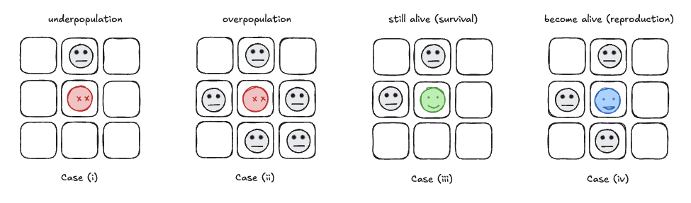
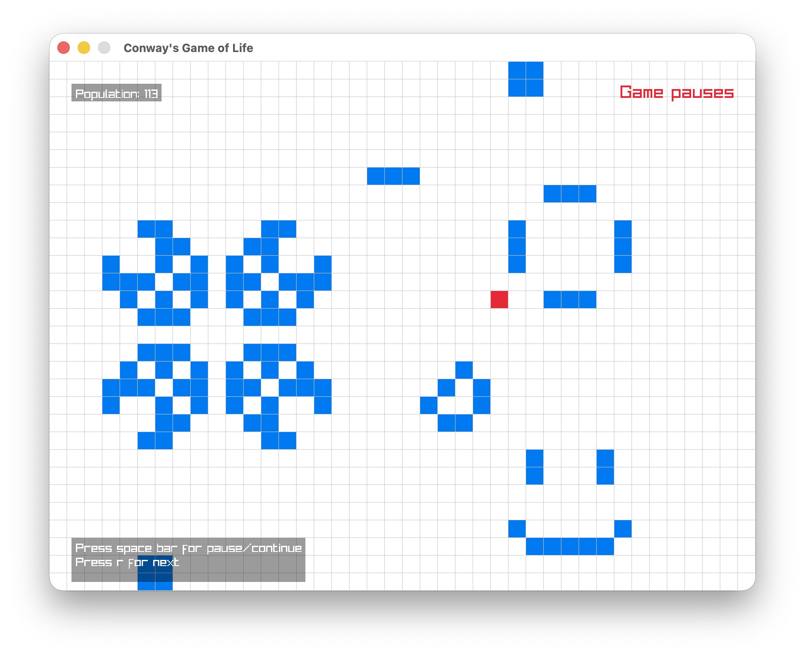

# Conway's Game of Life in Go using Raylib

This project is an implementation of Conway's Game of Life using the Go programming language and the Raylib graphics library. The Game of Life is a kind of cellular automaton created by John Horton Conway in 1970. Each state of the game depends on the initial state, which  can be thought of as a seed that generates the entire game. In each step, every cell becomes either alive or dead according to the following simple rules.



1. Any live cell with fewer than two live neighbours dies, as if caused by under-population.
2. Any live cell with two or three live neighbours lives on to the next generation.
3. Any live cell with more than three live neighbours dies, as if by over-population
4. Any dead cell with exactly three live neighbours becomes a live cell, as if by reproduction.

## Proejct Structure

The project is structured as follows:

```
.
├── config
│   └── config.go
├── game
│   ├── board.go
│   └── game.go
├── main.go
```

- `config/config.go`: Contains configuration settings for the game, such as window size and cell size.
- `game/board.go`: Contains the logic for the game board, including cell state management
- `game/game.go`: Contains the main game logic, including updating the board and rendering.
- `main.go`: The entry point of the application, where the game loop is implemented.

## Demo



## How to run the project

To run this project, make sure you have Go and Raylib installed on your machine. Then, follow these steps:

1. Clone the repository:
```bash
git clone https://github.com/RuffLogix/raylib-conway-game-of-life
cd raylib-conway-game-of-life
```

2. Install the Raylib Go bindings:
```bash
go get -u github.com/gen2brain/raylib-go/raylib
```

3. Run the project:
```bash
go run main.go
```
